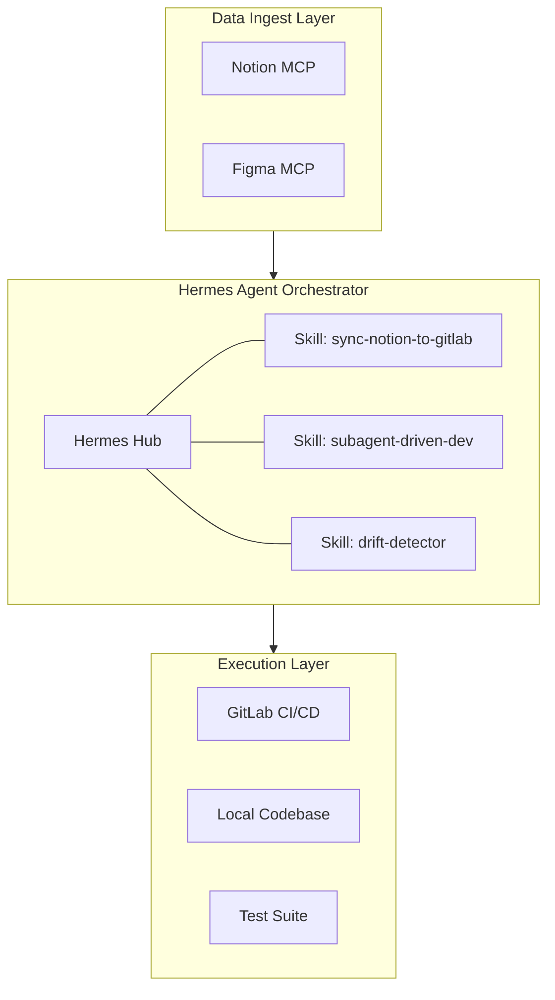
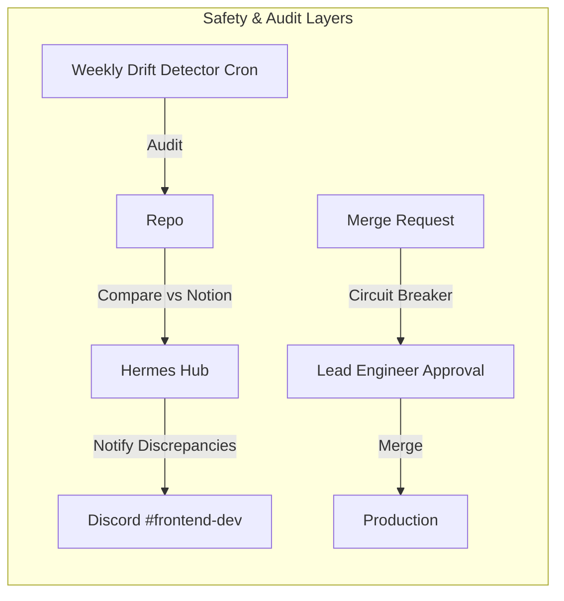
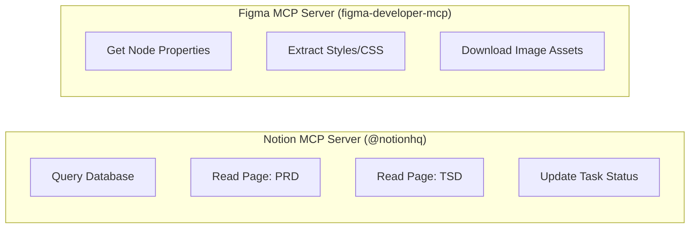
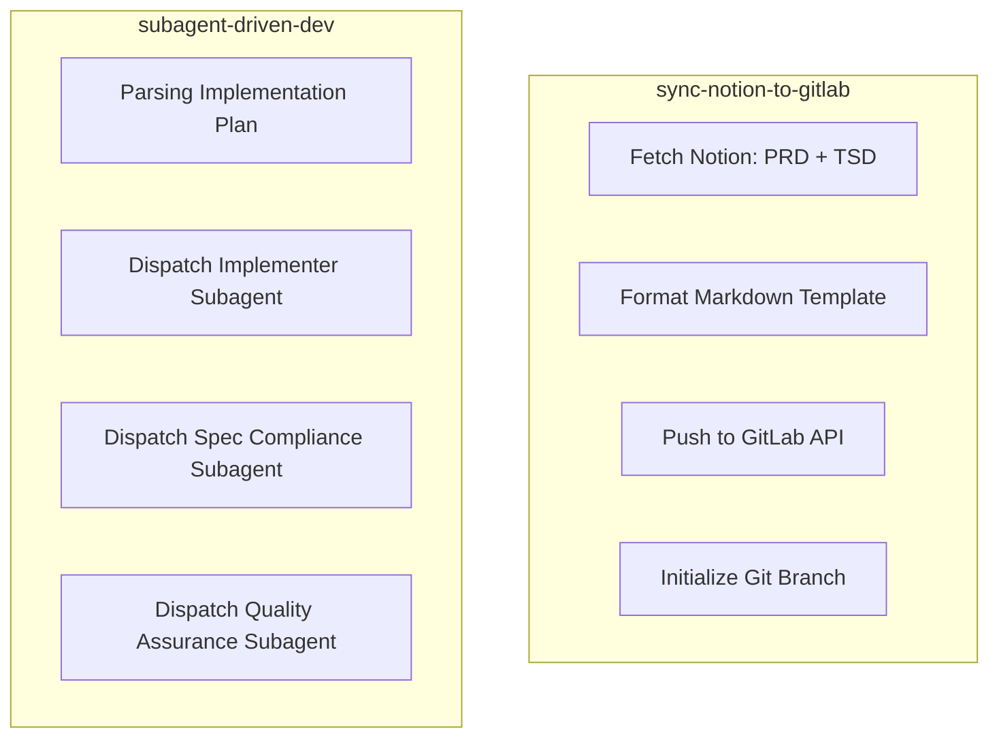
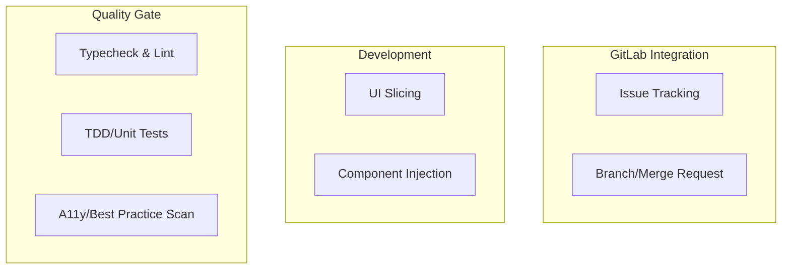
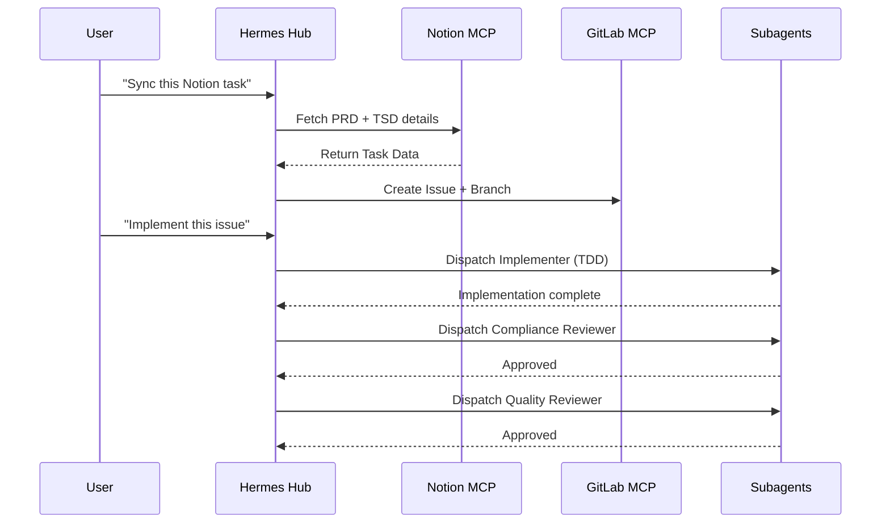

---
tags:
  - architecture
  - mermaid
  - deepdive
  - hardened
---

# Hermes Frontend Automation - Detailed Architecture

## High-Level Workflow

---

## The Hardened Infrastructure

---

## Node Deep-Dives

### 1. Inputs (MCP Layer)

### 2. Hermes Hub (Orchestrator Layer)

### 3. Outputs (Execution Layer)

---

## Orchestration Sequence

